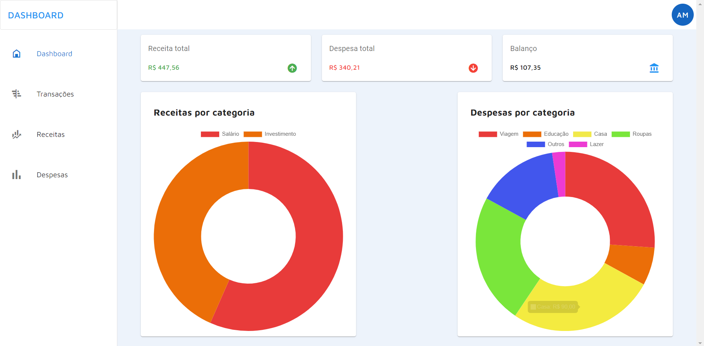

# Projeto Finans - Front-end
* [Sobre](#Sobre)
* [Autor](#Autor)
* [Instalação](#Instalação)
* [Tecnologias](#Tecnologias)

##Sobre
<h1 align="center">
  
</h1>
<p>Finans é um Dashboard financeiro feito com Vue Js onde se pode incluir receitas e despesas e obter gráficos através de dados obtidos de um Back-end feito em PHP e MYSQL.</p>

## Autor
Developed by Alex Maia 🚀

## Instalação
Instalar projeto
```
npm install
```

Compilar e abrir servidor para desenvolvimento
```
npm run serve
```

Compilar e minificar para produção
```
npm run build
```

## Tecnologias
As seguintes ferramentas foram usadas na construção do Front-end do projeto:

- [Vue Js](https://vuejs.org/)
- [Vue Router](https://router.vuejs.org)
- [Vuex](https://vuex.vuejs.org)
- [Vuetify](https://vuetify.com/en/)
- [Axios](https://axios-http.com/)
- [Chart Js](https://www.chartjs.org/)